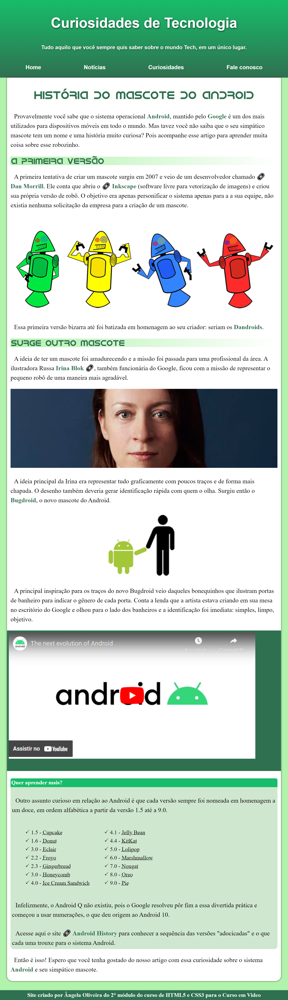

## 💫 Site Android 💫

Site criado no final do 2º modulo do Curso em video de **HTML5** e **CSS3**
&nbsp;

◻️ Além de colocar em prática a grande parte do assunto que estudei nesse módulo, esse site foi criado para contar a história do **mascote do android**

&nbsp;
Segue abaixo algumas técnicas que foram usadas para a construção:

* Responsividade de **video externo**, **imagens** e **caixas** 
* Utilização de **Favicon**
* Importação e utilização de **fontes externas**
* Utilização de **variável em cascata** 
* Navegação e links com utilização de **pseudo-classe** em CSS3
* Importação de **vídeo externo**

<a src="https://anjinha-oliveira.github.io/android/" alt="Link do site Android" target="_self">🔗 Para visitar website na clique aqui</a>

---

